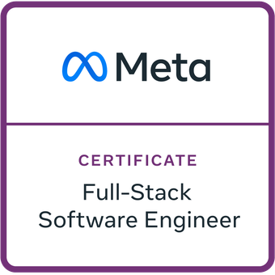
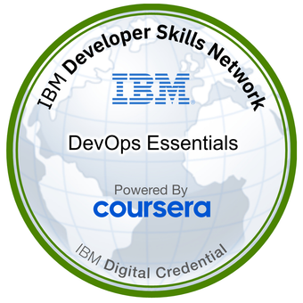
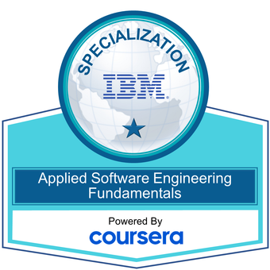

## 👋 Hi, I'm Dave

- 📫 How to reach me: David.Miserak@gmail.com
- 😄 Pronouns: He/Him
- ⚡ Fun fact: If I had to learn to code from scratch again I would start with Pascal.

### Credly

- [Credly Profile](https://www.credly.com/users/david-miserak)

#### Credly Badge Highlights

 

 

<!--
**DavidMiserak/DavidMiserak** is a ✨ _special_ ✨ repository because its `README.md` (this file) appears on your GitHub profile.

Here are some ideas to get you started:

- 🔭 I’m currently working on ...
- 🌱 I’m currently learning ...
- 👯 I’m looking to collaborate on ...
- 🤔 I’m looking for help with ...
- 💬 Ask me about ...
- 📫 How to reach me: ...
- 😄 Pronouns: ...
- ⚡ Fun fact: ...
-->
